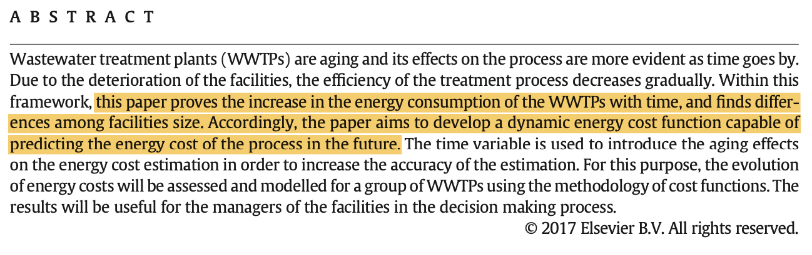
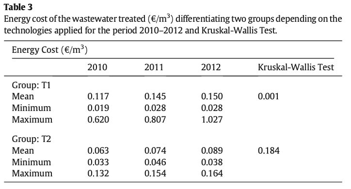

# Overview

* This paper sets out to predict energy cost of WWTPs as a function of age of facility, size of WWTP, and type of WWTP

Why:

* A large portion of the operating costs of a WWTP are associated with energy costs
* Mitigate environmental impact of WWTPs

```{r, out.width = "750px", echo = FALSE}

```

---

# The Data

* 966 Observations (322 WWTPs)
* All WWTPs from Spain, data from 2010, 2011, 2012
* Variables: energy cost, volume of WW treated, amount of contaminants, chemical oxygen demand (COD) removed from the WW, design flow, equivalent inhabitants

```{r, out.width = "750px", echo = FALSE}
knitr::include_graphics("table1.png")
```

---

# The Data Used in the Model

* Technology groups:    
    T1: Oxygen supply systems (activated sludge & extended aeration)    
    T2: Non-oxygen supply systems (biodisk technology)    
    Note: T1 is much more energy demanding than T2
* Both technology groups show an increase in energy cost over time, but only T1 has a statistically significant increase in our time period:

```{r, out.width = "450px", echo = FALSE, fig.align='center'}

```

---

# The Data Used in the Model (cont.)

* Volume of Wastewater Treated Groups:       
    D1: facilities that treat up to 55,000 $m^3$/year,       
    D2: $\dots$between 55,000 and 275,000 $m^3$/year,    
    D3: $\dots$ more than 275,000 $m^3$/year.
* They see statistical signifance in D2 and D1


* Data subset: D1/D2 "size" facilities that are also T1 (102 out of 322 WWTPs)

---

# The Model

* Models aging of WWTP in an interesting and more robust way than the previous literature
* Energy cost model variable desciption:     
    $EC = \text{energy cost per year}$,    
    $V = \text{volume of wastewater treated}~ (m^3 / \text{year})$,    
    $M =$ COD removed (kg/year),    
    $J =$ aging.
* Final EC model:
$$
EC = 0.125 \cdot V^{0.791} \cdot \exp(5.38 \times 10^{-8} \cdot M + 0.103 \cdot J)
$$

* Good fit: $r^2 = 0.890$

---

# Notes on the Model

* As volume of wastewater treated increases, energy cost increases, but slower with more volume        
    This may be explained by:      
    (1) larger facilities present better maintenance of the equipment     
    (2) smaller facilities tend to be oversized and deteriorate more rapidly, so differences in the energy consumption over time are more notable in these cases
    
* Coefficent on COD removed is **very** small   

---

# Key Takeaways

* Energy costs make up a large portion of the cost associated with maintaining a WWTP
* Energy costs increase with time, especially with smaller WWTPs
* Advise towns to invest in non-oxygen supply systems and to keep up on maintenance to avoid high energy costs