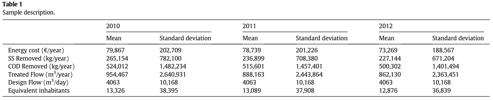

# Overview

What this paper sets out to do:

* Predict energy cost of WWTPs as a function of age of facility, size of WWTP, and type of WWTP.

Why:

* A large portion of the operating costs of a WWTP are associated with energy costs.
* Mitigate environmental impact of WWTPs.
* Important to WWTP managers (energy is expensive)

---

# The Data

* 966 Observations (322 WWTPs)
* All WWTPs from Spain, data from 2010, 2011, 2012
* Variables: energy cost, volume of WW treated, amount of contaminants, chemical oxygen demand (COD) removed from the WW, design flow, equivalent inhabitants

```{r, out.width = "750px", echo = FALSE}

```

---

# 

---

# The Model


---

# 