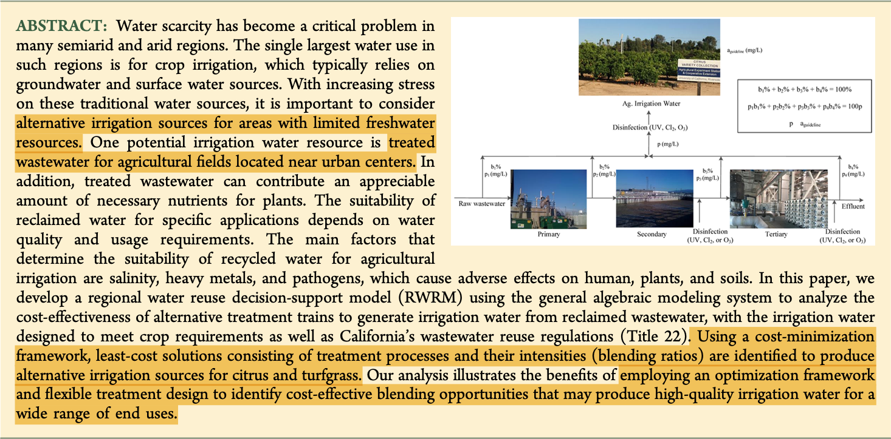
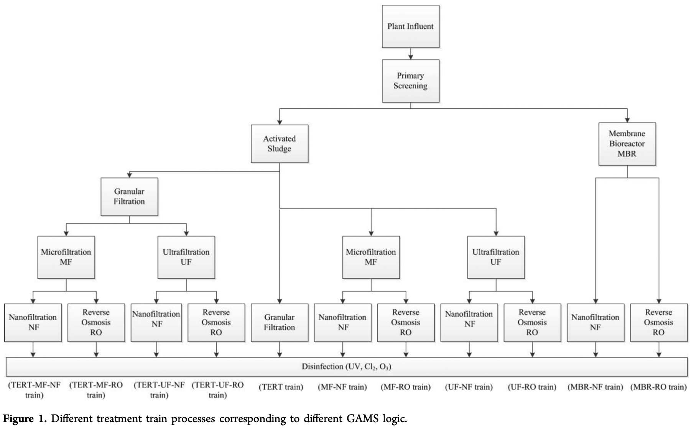

# Overview and Goals

* This paper sets out to optimize the cost of producing a water supply that meets and exceeds the water quality requirements for agriculutural reuse

* Explores 11 "treatment trains" 

* Proposes an optimized blending ratio of wastewater for each treatment train for turfgrass and citrus

```{r, out.width = "500px", echo = FALSE, fig.align='center'}

```

---

# Treatment Trains

* For each "train" they found the optimal proportion of wastewater in the treatment solution

* They did this for both turfgrass and citrus

```{r, out.width = "500px", echo = FALSE, fig.align='center'}

```

---
# Regional Water Reuse Decision-Support Model

* Inputs:      
    * Concentrations of water quality parameters in a given unit volume of wastewater    
    * Concentrations of water quality parameters associated with effluent from each treatment process    
    * Concentration limits of water quality parameters to meet crop requirements     
    * The unit cost for each treatment process.

* Constraints:      
    * Blending ratio equal to 1: $\sum_{j=1}^{J_T} b_t(J) = 1$     
    * Final ratio of constituents resulting from blending must be less than that of the crop's guidelines: $\sum_{j=1}^{J_T} p_T(i,j) \cdot b_T(j) \leq a(i)$

---

# Results (narrow)


---

# Results (general)


---

# Key Takeaways

*      
* 