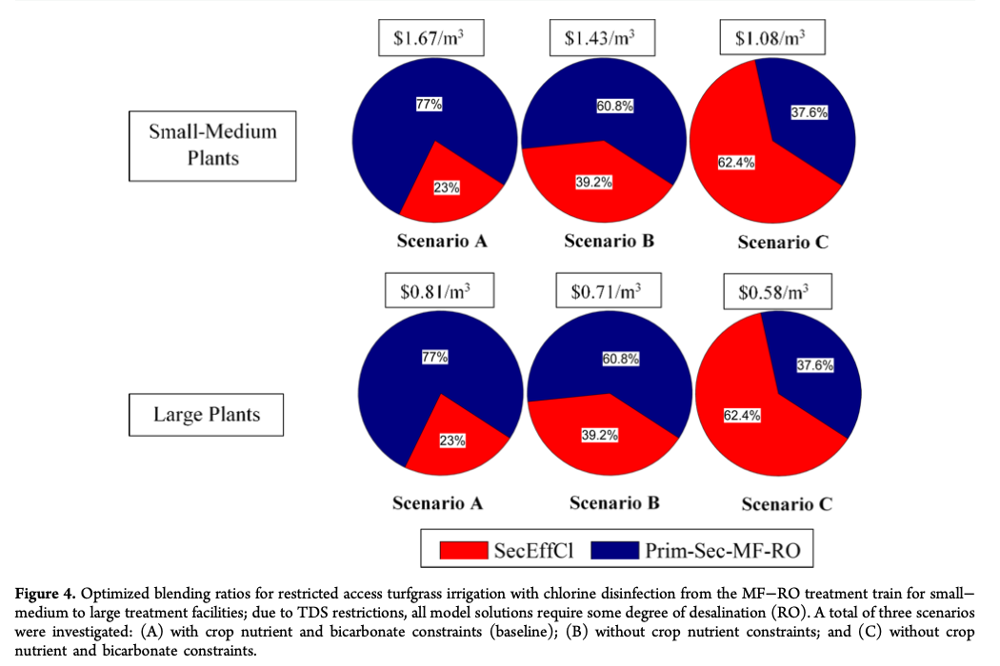

# Overview and Goals

* This paper sets out to optimize the cost of producing a water supply that meets and exceeds the water quality requirements for agriculutural reuse.
* Explores 11 "treatment trains." 
* Proposes an optimized blending ratio of wastewater for each treatment train for turfgrass and citrus.

```{r, out.width = "500px", echo = FALSE, fig.align='center'}

```

---

# Treatment Trains

* For each "train" they found the optimal blending of wastewater.
* They did this for both turfgrass and citrus.

```{r, out.width = "500px", echo = FALSE, fig.align='center'}

```

---
# Regional Water Reuse Decision-Support Model

* Inputs:      
    * Concentrations of water quality parameters in a given unit volume of wastewater.    
    * Concentrations of water quality parameters associated with effluent from each treatment process.    
    * Concentration limits of water quality parameters to meet crop requirements.     
    * The unit cost for each treatment process.

* Constraints:      
    * Blending ratio equal to 1: $\sum_{j=1}^{J_T} b_t(J) = 1$     
    * Final ratio of constituents resulting from blending must be less than that of the crop's guidelines: $\sum_{j=1}^{J_T} p_T(i,j) \cdot b_T(j) \leq a(i)$

---

# Results (narrow)

```{r, out.width = "500px", echo = FALSE, fig.align='center'}

```

* MF-RO treatment train results for turfgrass, under all three scenarios
* They produced $11\times 2 \times 6$ of these, total 132 ratios
---

# Results (broad)

## Citrus

* The treatment costs for large facilities were nearly 50% less than the costs under small−medium plant sizes, highlighting the effect of economies of scale.
* They were able to generate a feasible and cost-effective irrigation source for citrus while complying with Title 22 regulations and without affecting soil and crop health.

## Turfgrass

* Chlorine disinfection was necessary to ensure that the water quality was compliant with Title 22 regulations.
* Economies of scale still applies.


---

# Key Takeaways

*      
* 